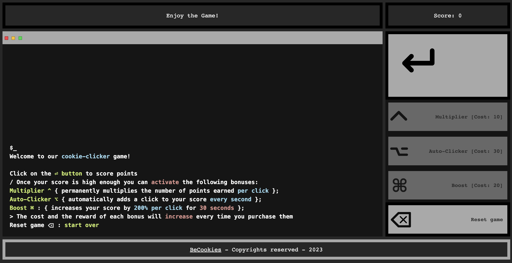

# BeCookies cookie-clicker

The [BeCookies](https://sanbimu.github.io/cookie-clicker) cookie-clicker is a game created by [Edgar Pringuet](https://github.com/edgarleon93), [Mike Incourt](https://github.com/vdemike) and Nathalie Appaerts. 

## Where to find our game

You can find it live here: https://sanbimu.github.io/cookie-clicker

## Technologies Used

Check the pkg.json for a complete list. But the most notable ones are:

- `tailwind` css framework
- `JavaScript`  

## Develop

1. `git clone` project
2. `yarn install # or npm run install` to install dependencies
3. `yarn run start # or npm run start` to start developing

---

&copy; 2023
